# 
## 1. STM32F7508-Discovery Swipe GUI 만들기  
  - [목차로 돌아가기](https://github.com/d-h-k/STM32F7508#%EB%AA%A9%EC%B0%A8-index)
 ### 설치가 필요한 것
  - [ST-LINK 설치 필수 !!!](https://my.st.com/content/my_st_com/en/products/development-tools/software-development-tools/stm32-software-development-tools/stm32-programmers/stsw-link004.license=1563552768058.product=STSW-LINK004.version=4.5.0.html)
 ### 참고영상 -  TOUCHGFX, STM
  - [TOUCHGFX 유툽 동영상](https://www.youtube.com/watch?time_continue=17&v=X20f1ag2x4Q)
  - [TOUCH GFX 유툽 체널](https://www.youtube.com/channel/UCPmAQbY9KbHqdQ_GwUGg1bA)
  - [STMicro사 유툽 체널](https://www.youtube.com/user/STonlineMedia)
 ### 실습결과 
  - [결과물 동영상 1 - 전자공작 카페](https://cafe.naver.com/circuitsmanual/213572) 
  - [결과물 동영상 2 - 전자공작 카페](https://cafe.naver.com/circuitsmanual/213571)
 ### 요구조건
   ```
    [퀘스트 2]
    1.TouchGFX를 이용해서 STM32F7508-DK보드상 LCD에 화면전환(screen swipe) 을 구현해보세요.
    2.터치스크린의 Swipe 동작시 두개 이상의 화면(윈도우)이 슬라이드 방식으로 화면전환되는 효과 구현.

    [퀘스트 통과 조건]
    1.보드에서의 동작을 녹화한 동영상을 “퀘스트2 (7.22~7.28)” 게시판에 올려주세요.
    2.글 작성 시 (소스파일을 프로젝트 폴더째) 압축해서 첨부합니다.
    3.작성한 글을 파일로 인쇄해서 PDF 파일로 저장합니다.
    4.상기 PDF파일 및 압축파일을 카페매니저 메일 @@@(보안상 가림) 으로 발송합니다.
    5.메일 발송하는 파일명에는 퀘스트번호 및 카페 별명을 추가해주세요

    [단계]
    1.TouchGFXDesigner에서 프로젝트 생성
    두개 이상의 Window를 생성하고 Swipe화면전환 기능 구현
    2.완료된 프로젝트를 Simulator 를 통해 확인
    3.완성된 프로젝트를 STM32F7508-DK 디스커버리 보드에 [Run Target] 버튼을 클릭하여 다운로드 합니다.
    4.다운로드 완료 및 디스커버리보드에서 실행
   ```
 #
 ## 따라하기
  - TouchGFX 를 실행 후 Simulaotr 에서 Change버튼을 클릭합니다
  - 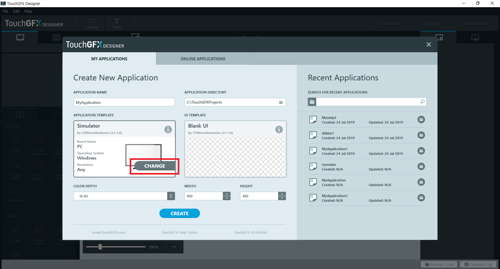
  - STM32F750 Discovery 를 선택합니다
  - 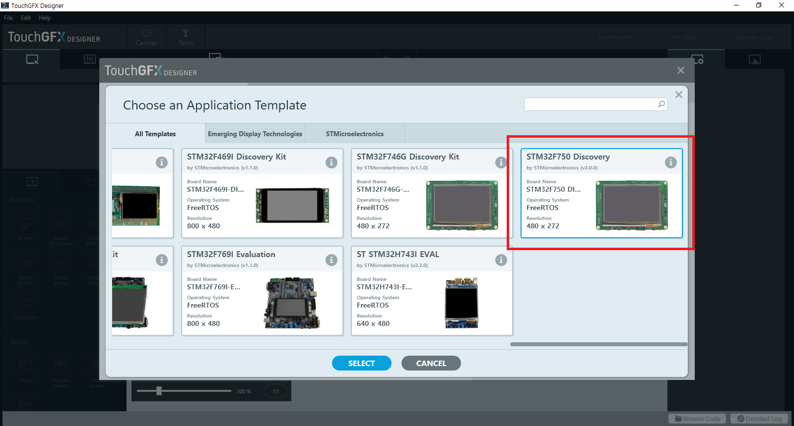
  - Blank UI 버튼을 클릭합니다
  - 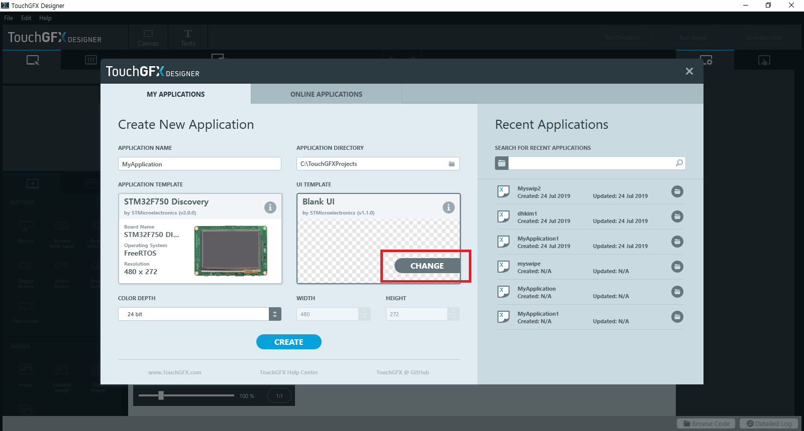
  - Swipe ... Example 버튼을 클릭합니다
  - 
  - SELECT 버튼을 클릭
  - 
  - CREATE 버튼을 클릭하여 프로젝트를 생성
  - 
  - 매번 뜨는 경고창입니다 Yes버튼을 눌러서 진행
  - 
  - 첫 화면에서 빨간색 박스 속 Text를 변경합니다 
  - 저는 "My First GUI APP" 이라는 텍스트로 변경하였습니다
  - 
  - 변경이 완료된 모습
  - 프로그램 좌측 상단에 Screen 항목을 클릭
  - 
  - 메뉴 다운 버튼을 클릭하여 펼치면 아래와 같은 3가지 항목이 추가로 보입니다
  - 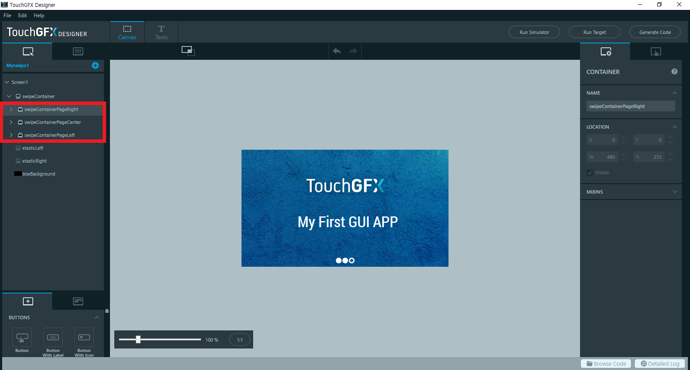
  - 빨간 박스속 항목을 선택
  - 
  - Text 매소드를 변경 -> UI 상으로는 가려서 보이지 않습니다만, 일단 텍스트를 집어넣습니다 추후 Simulator에서 확인이 가능합니다
  - 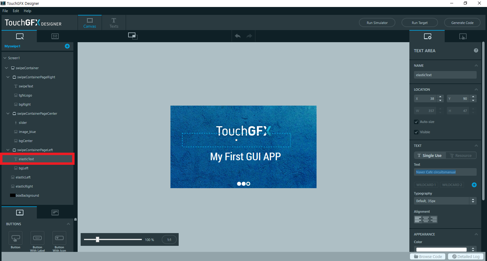
  - 이제 사진을 집어넣을 차례입니다.
  - 원하는 사진을 준비한 후 MS Paint(그림판 기본앱)으로 열어줍니다
  - 크기 조절 버튼을 클릭
  - 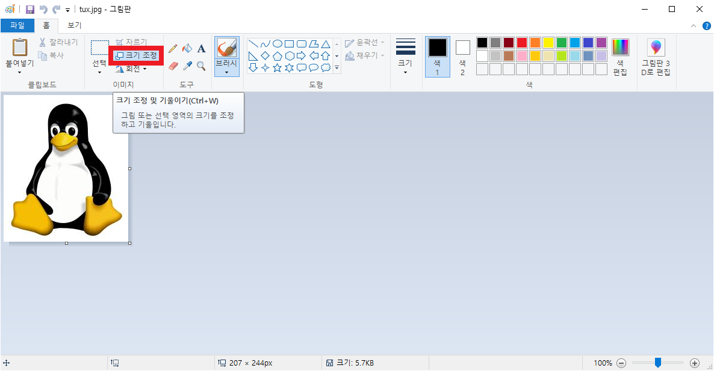
  - 사진과같이 3개 항목을 설정합니다
  - 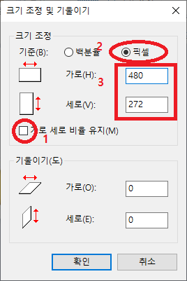
  - 리사이징을 완료한 사진은 png 형태로 저장합니다
  - 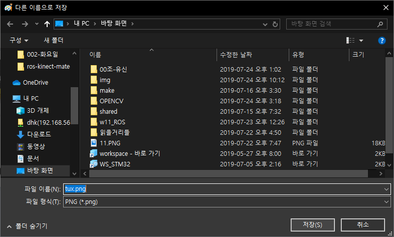
  - 이제 TouchGFX 툴에서 사진을 불러오겠습니다 +버튼 클릭
  - 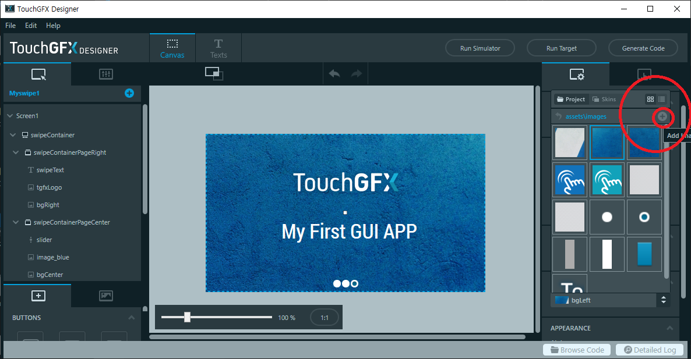
  - 이미지를 로드 후 Run Simulator 버튼을 클릭해 확인해 보겠습니다
  - 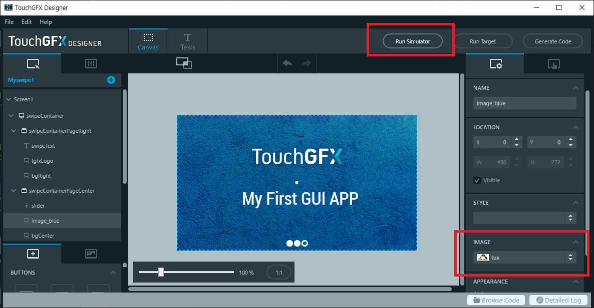
  - 시뮬레이션이 정상적으로 실행되어 확인할 수 있습니다.
  - 
  - 다음 페이지도 마찬가지로 삽입한 이미지가 정상적으로 들어가 있는 모습(사진은 tux)
  - 
  - 다시 프로그램으로 돌아와서 우측 상단에 Generate Code 버튼을 클릭
  - 
  - 보드가 연결된 상태라면 이어서 우측상단에 Run Target 버튼을 클릭
  - 혹 해당 시퀀스에서 에러가 발생하거나 반응이 없다고 생각한다면 좌측 하단에 에러코드를 확인하시기 바랍니다
  - 에러가 발생하는 경우 ST-Link 설치를 확인해보세요 [참고](https://my.st.com/content/my_st_com/en/products/development-tools/software-development-tools/stm32-software-development-tools/stm32-programmers/stsw-link004.license=1563552768058.product=STSW-LINK004.version=4.5.0.html)
  - 
  - 처음에 프로젝트를 저장한 폴더로 이동합니다
  - 
  - 용량낭비를 막기 위해 공통적인 몇가지 파일을 삭제하겠습니다(카페 공유를 위해)
  - 먼저 ST Driver폴더를 삭제해주세요
  - 
  - 삭제된 모습
  - 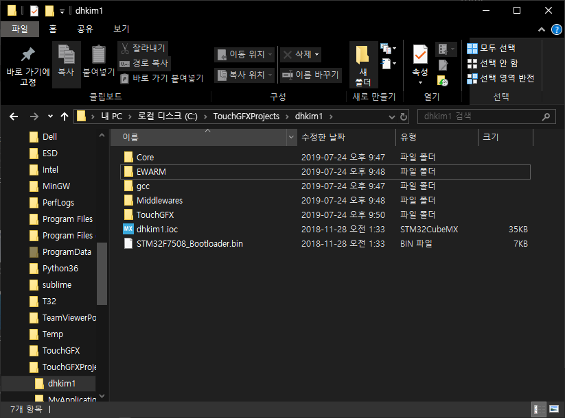
  - 하지만 100MB가 넘는 경우도 있네요 ㅠㅠ...
  - 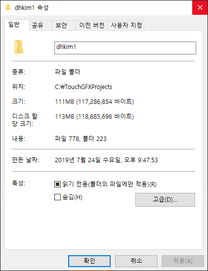
  - (사용자 디렉토리)\Middelware\ST\TouchGFX\ 위치에서 "lib" 폴더를 삭제 합니다
  - 
  - 이후 용량이 약 30MB정도 나오는것을 확인할 수 있습니다
  - 네이버 카페의 기본 첨부용량이 50MB이므로 이하의 사이즈로 줄이는것을 추천합니다
  - 읽어주셔서 감사합니다 ^^