# 
## 1. 프로젝트 생성과 BSP 가져오기
 ### [목차로 돌아가기](https://github.com/d-h-k/STM32F7508#%EB%AA%A9%EC%B0%A8-index)
 > 이 문서에서는 STM32F7508 DISCO 보드를 위한 프로젝트 생성과 BSP를 얻어오는 방법에 대하여 다룹니다
 ```
  - 이 글에서는 STM32CubeMX 와 Truestudio를 사용했습니다
  - 다른 유로컴파일러 사용하실 분들은 취향에 맞게 선택 가능합니다
  - 동일한 목적이나 결과를 얻기 위해서 다양한 방법이 있을수 있습니다
 ```
  - STM32CubeMX를 실행합니다 
  - File-> New Project를 눌러 새로운 프로젝트를 생성합니다
    - 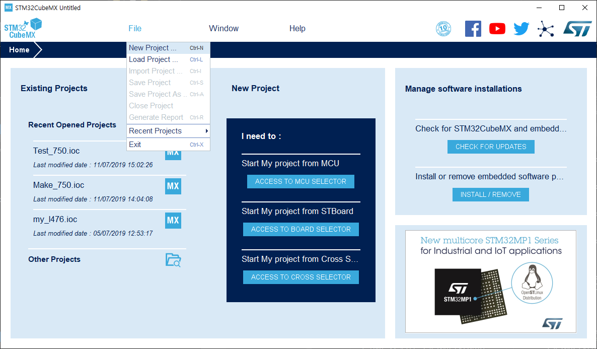 
  - Board Select 탭dptj 7508을 검색해 타겟보드를 선택합니다
    - 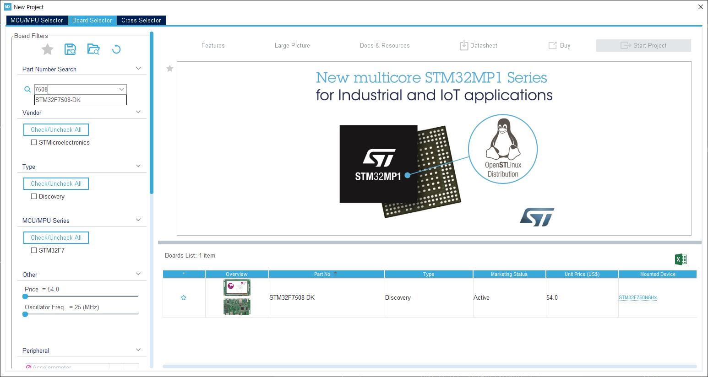 
  - Start project 혹은 항목 더블클릭을 합니다
    - 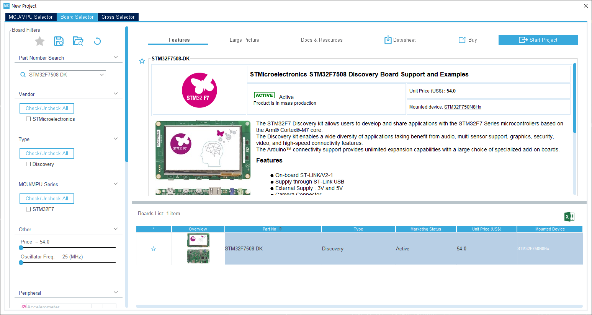 
  - 이런 메시지 창이 뜨는데 Yes를 선택해 줍니다
    -  
  - 프로젝트 이름을 본인이 원하는 이름으로(영어,숫자 조합을 추천)설정합니다
  - 본인이 사용하거나 원하는 Workspace 디렉토르로 Project Location을 설정합니다
  - IDE는 Truestudio를 선택합니다 -> 다른 유로컴파일러 사용하실 분들은 취향에 맞게 선택 가능합니다
    - 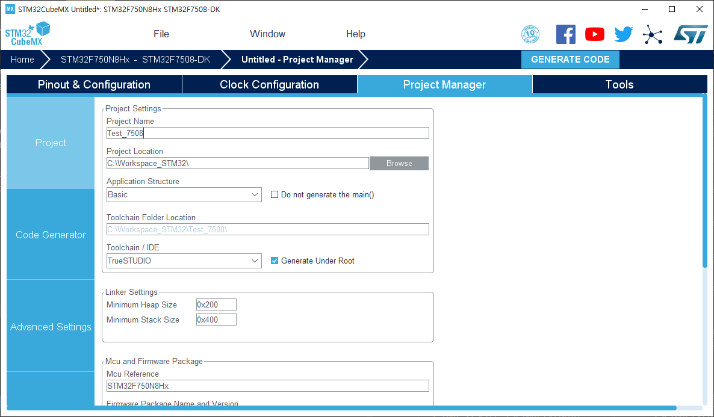 
  - Project Manager탭에서 Generrate periperial init... 항목의 박스를 체크 합니다
  - 이후 제너레이트 코드 항목을 선택에 프로젝트를 자동으로 생성합니다
    -  
  - 프로젝트 생성후 자동으로 Truestudio가 실행됩니다
  - 제작된 프로젝트에서 마우스 오른쪽버튼을 눌러 프로젝트 옵션으로 진입합니다
    - 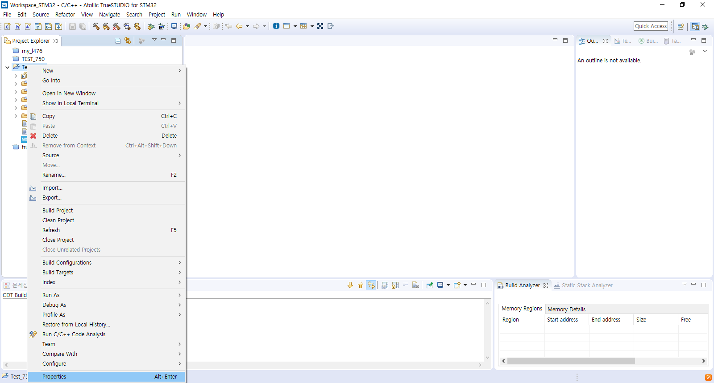 
  - Text file Encoding을 UTF-8로 설정합니다
    -  
  - Code convention을 GNU로 선택합니다 
  - Tab policy를 space only로 설정합니다
  - 탭사이즈와 들여쓰기(인덴트)를 모두 2로 설정합니다
    - 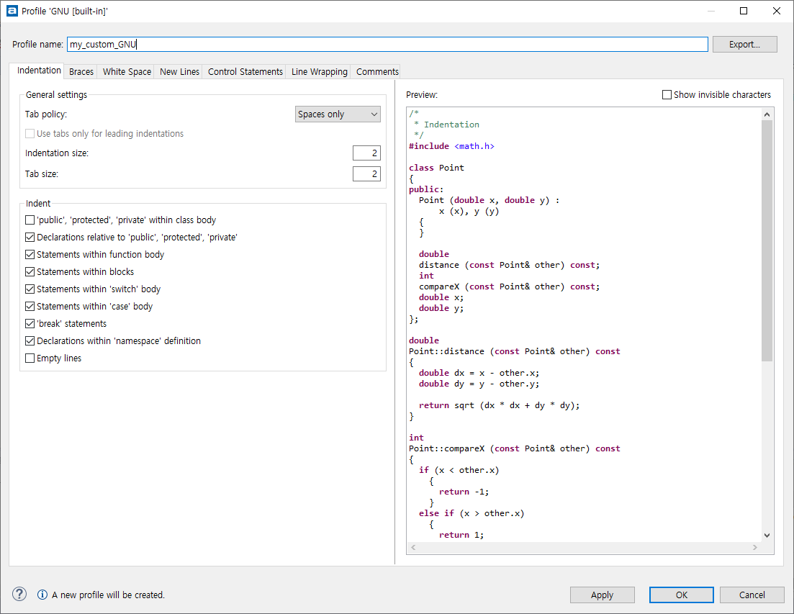 
  - 그다음 Build항목에 가서 Enable paralle build를 선택 후, 사진과 같이 설정합니다
    -  
  - 프로젝트를 빌드합니다(ctrl + B)
    -  
  - 이제 BSP를 프로젝트에 추가하겠습니다
  - 큐브에서 생성된 프로젝트가 위치한 디렉토리로 이동합니다
  - 그리고 STM32Cube에서 제공해주는 Repo 폴더로 이동합니다
    > Repo 폴더 위치
    ```s
    C:\Users\dhkim(계정명)\STM32Cube\Repository\STM32Cube_FW_F7_V1.15.0
    ```
    - 
  - Utilities 라는 폴더를 프로젝트 폴더로 복사해오는데, Media, PC Software폴더는 복사 해 오지 않습니다
    ```s
    C:\Users\dhkim(계정명)\STM32Cube\Repository\STM32Cube_FW_F7_V1.15.0\Utilities
    ```
  - 사용자 프로젝트 폴더로 \Utilities 복사가 끝난 모습
    - 
  - 복사할 파일은 총 4개이며 사진상의 선택된 폴더들 입니다
    - 
  - 이제 \BSP\Components, \BSP\STM32F7508-Discovery 두가지 폴더를 복사해오겠습니다
    ```s
    C:\Users\dhkim(계정명)\STM32Cube\Repository\STM32Cube_FW_F7_V1.15.0\Drivers\BSP\STM32F7508-Discovery
    ```
    ```s
    C:\Users\dhkim(계정명)\STM32Cube\Repository\STM32Cube_FW_F7_V1.15.0\Drivers\BSP\Components
    ```
  - Components, STM32F7508-Discovery 두가지 폴더를 복사해서 사용자 프로젝트 폴더의 \Drivers\BSP 위치에 복사합니다
    ```
    \Drivers\BSP
    ```
    - 
  - 사용자 폴더로의 복사가 끝난 모습  
    -  
  - 사용자 폴더의 복사가 끝난 모습
    - 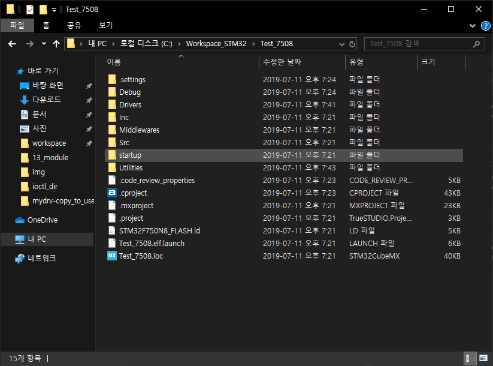
  - 이제 다시 Truestudio로 돌아와서 추가로 생성된 코드 폴더들을 추가 해 줍니다.
  - 프로젝트에서 추가된 코드 폴더 최종 디렉토리 -> Add/Remove ... 항목을 클릭
    - 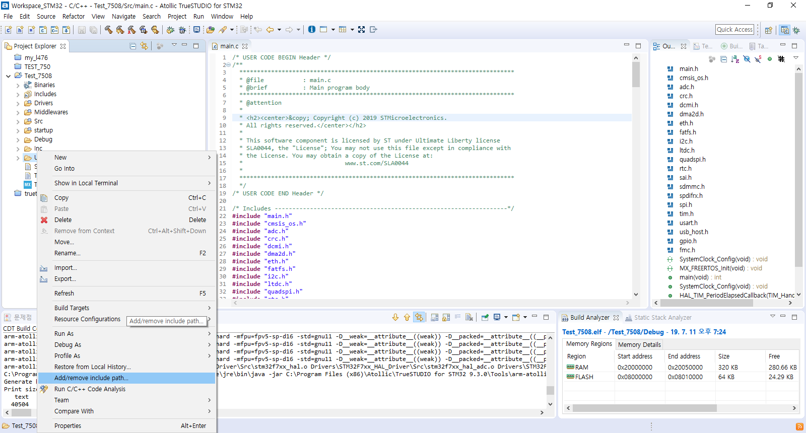
  - 이떄 주의사항은 꼭 xx.h/xx.c파일이 담겨있는 디렉토리를 인클루드 해야 합니다.
  - 이에 관한 자세한 사항은 [이클립스 사용법을 참고하시면 됩니다](https://itmir.tistory.com/511) <-링크 클릭
  - [이클립스 사용설명서](https://www.google.com/search?rlz=1C1SQJL_koKR813KR813&biw=1213&bih=581&ei=U1YpXc6FKYHZ-QbahYLoDA&q=%EC%9D%B4%ED%81%B4%EB%A6%BD%EC%8A%A4+%EC%82%AC%EC%9A%A9%EC%84%A4%EB%AA%85%EC%84%9C&oq=%EC%9D%B4%ED%81%B4%EB%A6%BD%EC%8A%A4+%EC%82%AC%EC%9A%A9%EC%84%A4%EB%AA%85%EC%84%9C&gs_l=psy-ab.3...3786.7756..8710...8.0..0.145.2196.5j16......0....1..gws-wiz.......0j33i160j35i39j0i131j0i30j0i13j0i13i30j0i13i5i30.TmQTqtNl9T8)
    - 
  - 폴더를 추가할 때 마다 해당 창이 팝업되는데 OK를 클릭합니다
    - 
  - 그리고 Clean Project 를 한번 클릭하시고 다시 빌드합니다
    - 
  - 아마 아래와 같은 에러가 발생하는데, 동일한 BSP가 두번 포함되서 발생하는 에러입니다.
  - C언어에서의 함수명은 유일하기때문에(함수명은 그 자체로 함수의 시작번지를 가르치는 포인터이므로) 중복되는 함수명 에러를 없애줘야 합니다
    - 
  - 에러가 발생한 상황
    - 
  - 사진속의 두가지 파일을 filesystem 상에서 삭제 합니다
    - 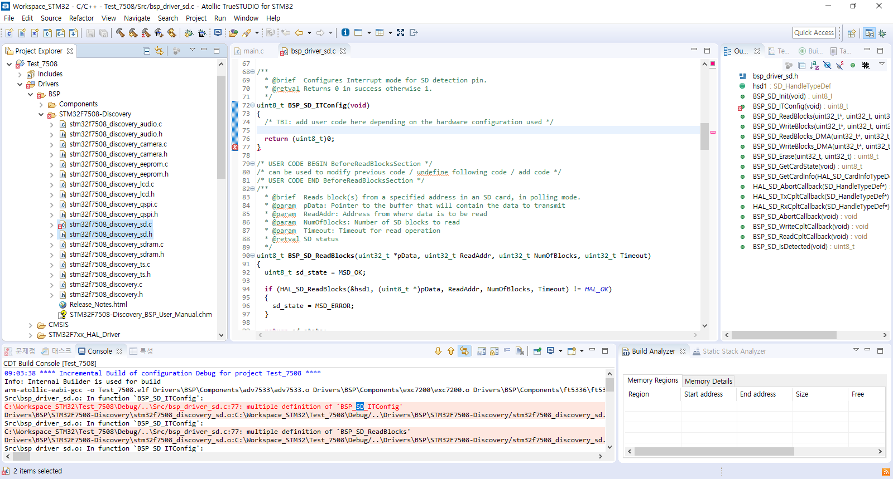
  - 아래 사진과 같이 마우스 오른쪽 버튼을 눌러 Delete버튼 클릭하여 삭제합니다
    - 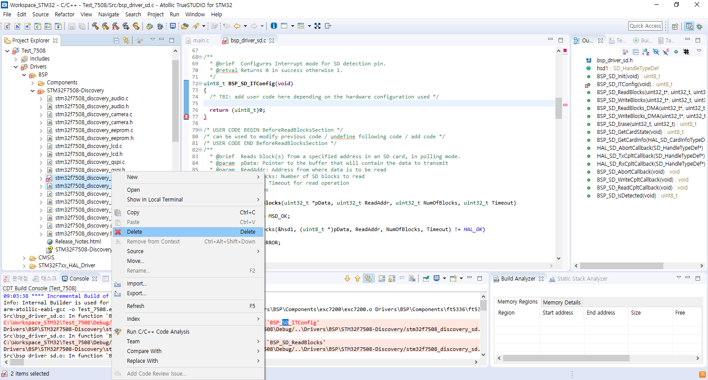
  - 프로젝트를 다시 빌드하여 문제없이 프로젝트 빌드 성공을 확인합니다
    - 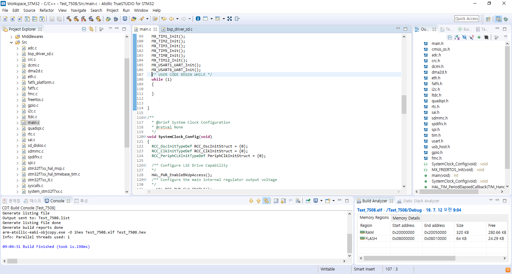
  - 혹시나 해당 에러가 발생한다면 위의 항목 중 "이떄 주의사항은 꼭 xx.h/xx.c파일이 담겨있는 디렉토리를 인클루드 해야 합니다" 항목으로 돌아가서 다시 폴더를 인클루드 합니다
    - 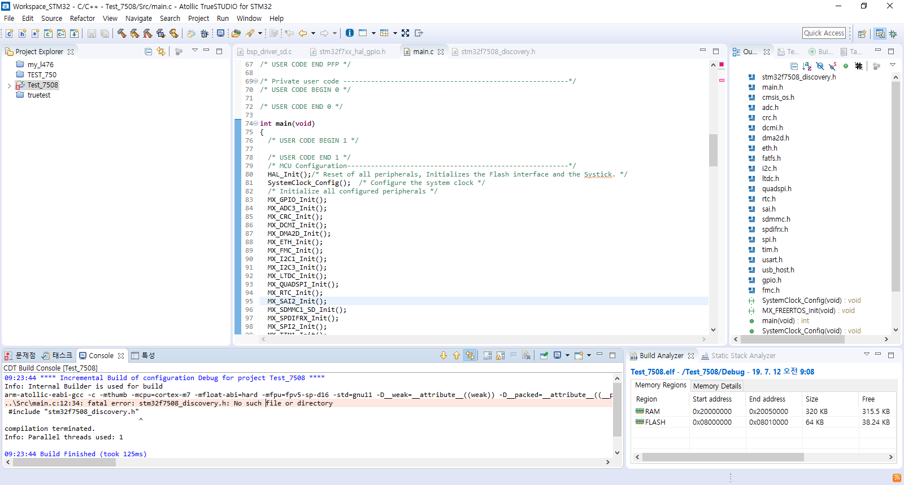
  - 아래 사진속의 프로젝트 설정 창에서도 확인이 가능합니다  
    - 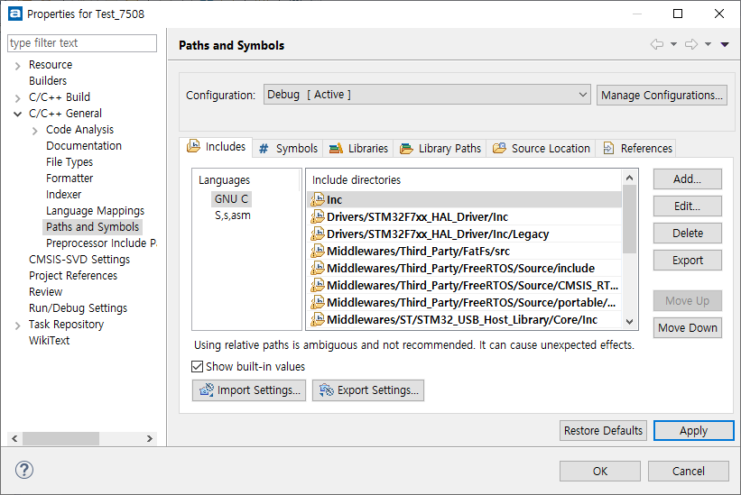
  - 빌드 성공을 확인
    - 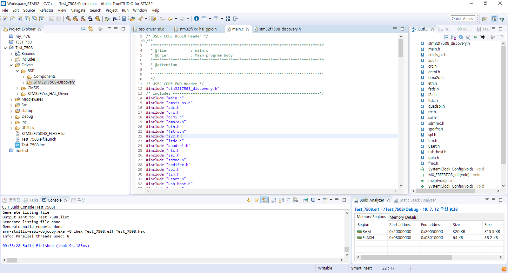
  
  - 이제 메인함수를 살짝 변경해 LED Blinky 예제로 만들어 보겠습니다
  - RTOS부분을 삭제해줍니다. 당분간은 Firmware 레벨의 코드를 제작 및 테스트 하므로  RTOS부분을 제거하거나 주석처리 합니다.
  - 아래 코드는 프로그램의 실행 흐름에서 제거 되어야 할 부분입니다
    ```c
      MX_ADC3_Init();
      MX_CRC_Init();
      MX_DCMI_Init();
      MX_DMA2D_Init();
      MX_ETH_Init();
      MX_FMC_Init();
      MX_I2C1_Init();
      MX_I2C3_Init();
      MX_LTDC_Init();
      MX_QUADSPI_Init();
      MX_RTC_Init();
      MX_SAI2_Init();
      MX_SDMMC1_SD_Init();
      MX_SPDIFRX_Init();
      MX_SPI2_Init();
      MX_TIM1_Init();
      MX_TIM2_Init();
      MX_TIM3_Init();
      MX_TIM5_Init();
      MX_TIM8_Init();
      MX_TIM12_Init();
      MX_USART1_UART_Init();
      MX_USART6_UART_Init();
    ```
    - 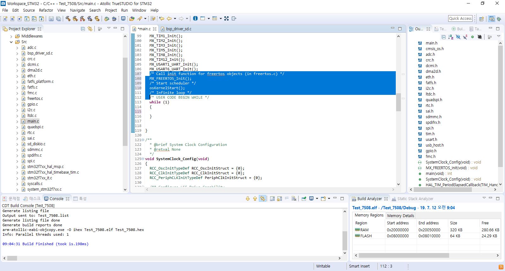
  - 사용하지 않는 Peri들의 초기화 코드를 일단 주석처리를 합니다.
    - 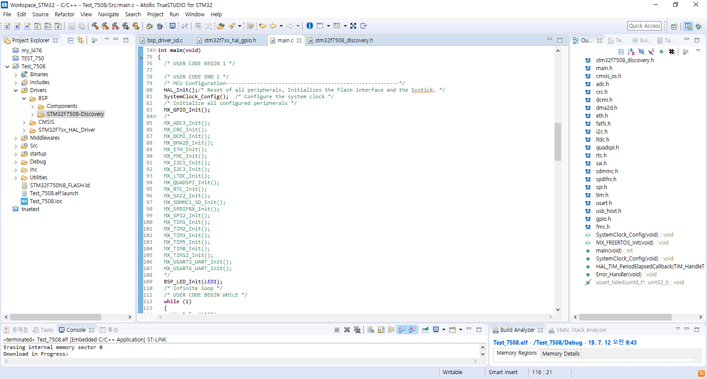  
  - LED 관련 깜빡이는 코드를 작성합니다. 이 코드는 BSP함수를 그대로 이용합니다
  - 아래 코드는 LED 점멸 동작을 위해 필수적으로 포함 해야 할 코드 입니다
    ```cpp
    BSP_LED_Init(LED1); // LED의 초기화
    BSP_LED_On(LED1); // LED On
    BSP_LED_Off(LED1); // LED Off
    BSP_LED_Toggle(LED1); // LED Toggle
    HAL_Delay(999); //Delay 함수
    ```
    - 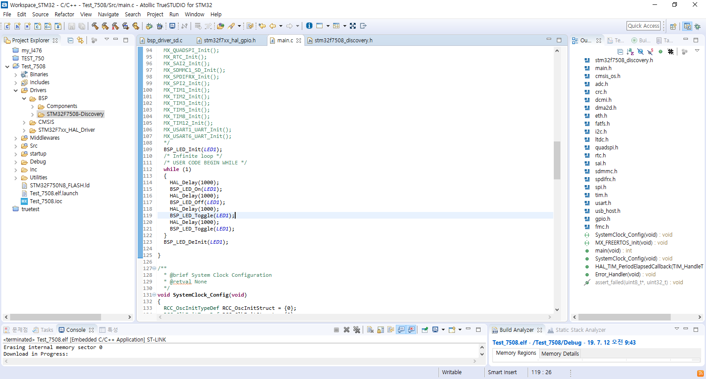
  - 이후 디버깅모드 진입 -> 프로그램 실행을 통해 LED점멸 동작을 확인합니다
  - 이상으로 간단하게 하드웨어 리뷰 및 설명을 마치겠습니다.
  - 부족한 글 끝가지 읽어 주셔서 감사합니다
